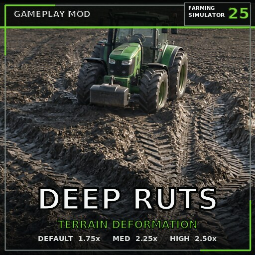

# FS25 Deep Ruts



**Make every pass leave a deeper mark.**

Deep Ruts is a gameplay mod for Farming Simulator 25 that increases the strength of the game's native dynamic terrain deformation. Vehicles leave deeper physical wheel ruts while FS25 continues to determine the result from the ground, moisture, vehicle, tires, and driving conditions.

## Download

Download the ready-to-use mod: [FS25_DeepMudRuts.zip](FS25_DeepMudRuts.zip)

Place the ZIP in:

```text
Documents/My Games/FarmingSimulator2025/mods
```

Select the mod when loading your savegame and make sure FS25's **Ground Deformation** gameplay setting is enabled.

## Rut-depth settings

Change the preset under **Game Settings → Deep Ruts**.

| Setting | Displacement scale |
| --- | ---: |
| Off / Base Game | 1.00× |
| Default | 1.75× |
| Medium | 2.25× |
| High | 2.50× |

The default setting is **1.75×**. The selected preset is stored with the savegame and applies immediately to loaded wheels.

## Surface behavior

Deep Ruts changes only FS25's native wheel terrain-displacement scale. It does not make every surface deformable. Concrete, paved surfaces, and other ground types that the game or map defines as non-deformable remain unaffected. Results on gravel and custom map materials depend on how that map has configured native ground deformation.

## Compatibility

Designed to work alongside:

- **Mud System Physics**
- **Use Up Your Tyres**

Deep Ruts changes only `WheelPhysics.displacementScale`. It does not replace mud traction, tire pressure, tire wear, wheel radius, resistance, friction, or extra-sink systems, allowing the other mods to continue handling those features.

## Multiplayer

Multiplayer is supported. The server host or administrator controls the rut-depth setting, which is synchronized to joining players.

## Performance

The mod adds no per-frame update loop. It applies the selected scale when wheel physics initializes and when the setting changes. Visible deformation is still handled by FS25's native ground-deformation system.

## Version

**1.0.0.0**

## Author

**SecondChanceGaming3709**
